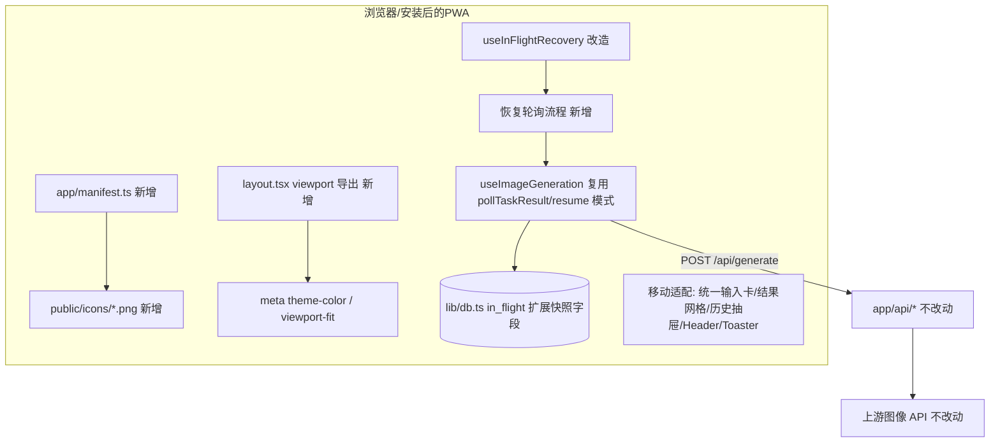
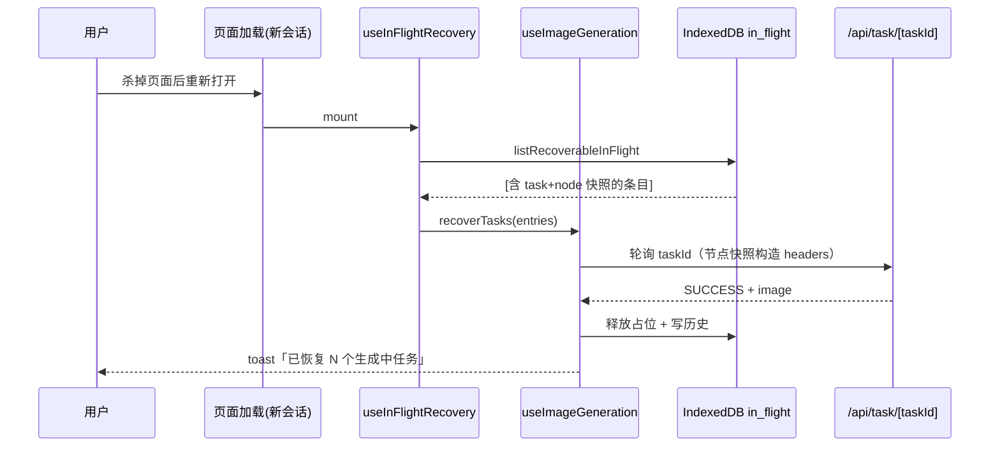

# DESIGN: android-pwa

## 整体架构（改动点标注）

## 分层与组件

| 层 | 改动 | 说明 |
|---|---|---|
| PWA 壳 | `app/manifest.ts`、`app/layout.tsx`、`public/icons/` | name/short_name/start_url/display:standalone/theme_color/background_color/icons(192+512, maskable)；viewport: themeColor 双媒体查询 + viewportFit cover |
| 移动适配 | `components/*`、`app/page.tsx`、`app/globals.css` | 360px 无横向滚动；safe-area padding；触控目标；输入 16px 防 iOS/Android 聚焦缩放；Toaster 小屏 bottom-center；HistoryDrawer 小屏全屏化 |
| 任务恢复 | `lib/db.ts`、`hooks/useInFlightRecovery.ts`、`hooks/useImageGeneration.ts`、`app/page.tsx` | InFlightEntry 增加 `task` 快照（GenTask 最小集）与 `node` 快照；恢复 = 列出 recoverable → 逐条以 task.taskId + node 快照续轮询 → 注入 tasks[] → 复用成功后写历史/释放占位的既有路径 |

## 数据流（恢复路径）

## 异常处理策略

- 恢复轮询沿用 `pollTaskResult` 的容错（连续失败退避、TASK_FAILED 即终止、超时进入现有 `timeout` 状态保留"继续等待"）。
- 无节点快照的旧条目 / 激活节点缺失：不恢复，标记 abandoned，toast 文案改为"检测到 N 个未完成任务，可能已在上游完成；为避免重复扣费请先查看历史，确认后再重新发起"——不再引导直接重发。
- 恢复失败不阻塞页面加载（整体 try/catch，console.warn）。

## 测试策略

- 类型与 lint 作为门禁（仓库无测试套件，遵循现状）。
- 恢复路径用 dev server + 浏览器手工冒烟：提交任务 → 杀标签页 → 重开 → 观察恢复 toast 与结果入库。
- 移动适配用 Playwright 360×800 视口截图自检，对照验收标准逐条核对。
