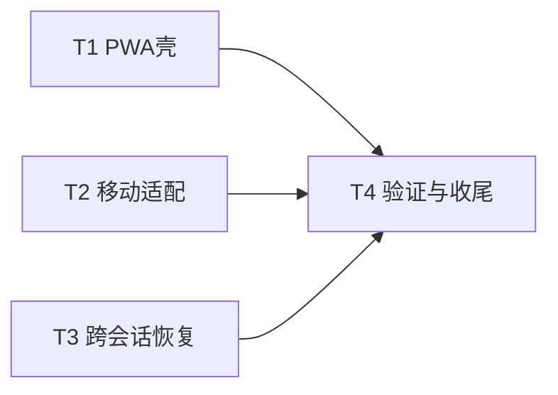

# TASK: android-pwa

## 任务依赖图

T1/T2/T3 可并行，T4 汇总验收。执行顺序 T1 → T2 → T3 → T4。

## T1 PWA 壳

- **输入契约**：`app/globals.css` 主题变量（light bg #fff、dark bg ≈ oklch(0.18 0.02 250)）；现有 `app/favicon.ico`。
- **输出契约**：`app/manifest.ts`；`public/icons/icon-{192,512}.png`（purpose ["any","maskable"] 全出血）；`layout.tsx` 增加 viewport 导出（themeColor light/dark、viewportFit cover）。验收：`/manifest.webmanifest` 可访问且字段正确；meta 标签出现在 HTML。
- **实现约束**：不新增依赖；图标由 SVG 经浏览器截图生成；遵守 Next 16 manifest/viewport API（已核对内置文档）。

## T2 移动适配

- **输入契约**：现桌面优先 UI（`app/page.tsx`、`components/UnifiedInputCard.tsx`、`ResultGrid.tsx`、`HistoryDrawer.tsx`、`Header.tsx`、`SettingsDialog` 等、`app/globals.css`、`layout.tsx` Toaster）。
- **输出契约**：360×800 下无横向滚动、核心流程可用、触控目标 ≥44px、输入 ≥16px、safe-area 适配、Toaster 小屏居中、HistoryDrawer 小屏全屏/底部化。
- **实现约束**：只用 Tailwind 响应式类与少量 CSS 变量，不改交互逻辑与数据流；不引入新组件库。

## T3 跨会话任务恢复

- **输入契约**：`lib/db.ts`（in_flight API）、`hooks/useInFlightRecovery.ts`、`hooks/useImageGeneration.ts`（claim/updateStatus/release 调用点、resumeTask、pollTaskResult）、`lib/types.ts` GenTask。
- **输出契约**：
  1. 提交成功后，in_flight 条目含 task 快照（prompt/model/size/quality/n/batchId/slot/compareGroup）与 node 快照（id/name/baseUrl/apiKey/proxyUrl）。
  2. 启动时 recoverable 条目自动续轮询：任务注入 tasks[]、成功写历史、释放占位、toast「已恢复 N 个生成中任务」。
  3. 不可恢复条目（无快照/节点缺失）标记 abandoned，toast 不再引导"重新发起"，改为防重复扣费话术。
- **实现约束**：复用 `pollTaskResult`；恢复流程与 `resumeTask` 保持同构；轮询 headers 必须用提交时的节点快照（不可用当前激活节点）；任何失败不阻塞页面加载。

## T4 验证与收尾

- **输出契约**：`npx tsc --noEmit` 0 错误；`npm run lint` 通过；Playwright 360×800 冒烟截图核对验收标准 2；恢复场景手工冒烟通过；更新 ACCEPTANCE/FINAL/TODO 文档。
