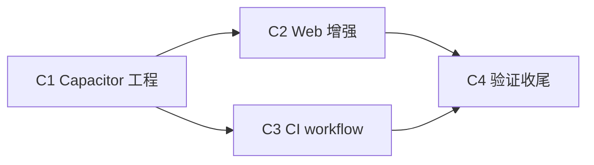

# TASK: capacitor-apk

## C1 Capacitor 工程

- **输入契约**：PWA 视觉资产（星芒 SVG 派生物）、生产域名、Node v22 环境。
- **输出契约**：package.json 增 Cap 依赖；`capacitor.config.ts`；`cap-www/index.html` 兜底页；`assets/`（icon-1024、splash 2732 亮/暗）；`android/` 原生工程入库（含生成的图标/启动屏 res、manifest 权限）；`.gitignore` 覆盖 gradle 构建产物。
- **实现约束**：`npx cap add android` 标准流程；图标/启动屏用 `@capacitor/assets` 从 PWA 同源 SVG 生成；media 插件权限写进 AndroidManifest。

## C2 Web 端 APP 环境增强

- **输入契约**：`page.tsx`（showHistory 状态）、`ResultGrid.tsx`（预览头 + b64 数据源）、`Header.tsx`（applyTheme）、`lib/`。
- **输出契约**：`lib/capacitor-env.ts`；backButton 监听（关抽屉/退出）；「保存到相册」按钮（仅 APP 环境、mounted 门控、失败 toast）；状态栏随主题。浏览器行为零变化。
- **实现约束**：全部动态 import + 门控；不改桌面/PWA 渲染路径。

## C3 CI workflow

- **输出契约**：`.github/workflows/android-apk.yml`，workflow_dispatch，产出 APK artifact。语法完整可触发（真跑由用户推送后验证）。

## C4 验证与收尾

- **输出契约**：tsc/lint/build/cap sync 全过；浏览器冒烟确认 AC3；ACCEPTANCE/FINAL/TODO 更新；分步提交。
