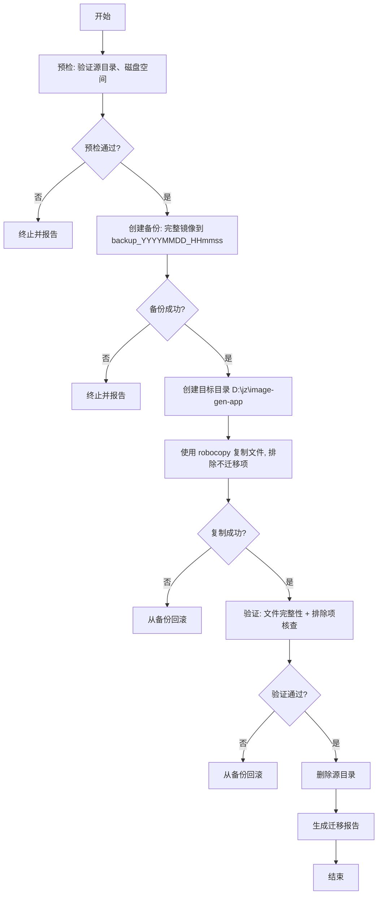

# CONSENSUS - 项目迁移任务共识文档

## 1. 明确的需求描述

将 `d:\jz\project\image-gen-app`（AI 图片生成桌面应用，Next.js + Electron）项目**完整移动**到 `D:\jz\image-gen-app` 目录。

迁移后源目录不再存在，目标目录成为项目的唯一存放位置。

## 2. 验收标准

### 2.1 必须满足（Must）
| # | 验收项 | 验证方法 |
|---|--------|---------|
| 1 | `D:\jz\image-gen-app` 目录存在 | `Test-Path` 检查 |
| 2 | 源代码完整（app、components、electron、lib、public、scripts） | 目录列表对比 |
| 3 | 配置文件完整（package.json、tsconfig.json、next.config.ts、eslint.config.mjs、postcss.config.mjs、vercel.json、components.json、AGENTS.md、CLAUDE.md、README.md） | 目录列表对比 |
| 4 | `.git/` 完整保留，Git 仓库可正常使用 | `git status` 无错误 |
| 5 | `.env` / `.env.local`（如果存在）已迁移 | 文件存在性检查 |
| 6 | `.env.example` / `.env.local.example` 已迁移 | 文件存在性检查 |
| 7 | `.trae/` 已迁移 | 目录存在性检查 |
| 8 | `node_modules` 未迁移 | 目录不存在性检查 |
| 9 | `.next`、`dist2`、`build` 未迁移 | 目录不存在性检查 |
| 10 | `tsconfig.tsbuildinfo` 未迁移 | 文件不存在性检查 |
| 11 | `test-*` 测试文件未迁移 | 文件存在性检查 |
| 12 | `启动.bat` 未迁移 | 文件存在性检查 |
| 13 | 源目录 `d:\jz\project\image-gen-app` 不再存在 | `Test-Path` 否定 |
| 14 | 备份在迁移前已生成 | 备份目录存在 |

### 2.2 期望满足（Should）
- 备份可在 7 天内用于回滚
- 操作过程有详细日志记录
- 不影响 D:\jz 下其他子项目

## 3. 技术实现方案

### 3.1 整体流程图

### 3.2 关键技术选型

| 环节 | 工具/命令 | 选择理由 |
|------|----------|---------|
| 备份 | `robocopy` + 7z | robocopy 速度快、保留权限；7z 压缩节省空间 |
| 复制 | `robocopy /MIR /XF /XD` | Windows 原生，支持细粒度排除 |
| 校验 | PowerShell `Get-FileHash` | SHA256 比对 |
| 删除 | `Remove-Item -Recurse` | 二次确认防误删 |

### 3.3 详细执行步骤

**步骤 1：预检**
- 确认源目录存在且可访问
- 确认 D:\jz 存在，目标子目录不存在（或为空）
- 检查磁盘空间（建议预留 2GB）

**步骤 2：备份**
- 创建 `D:\jz\image-gen-app-backup-YYYYMMDD-HHmmss` 目录
- 完整镜像源目录（**包含** node_modules 等，便于回滚后立即可用）

**步骤 3：创建目标**
- 创建 `D:\jz\image-gen-app` 目录
- 不创建子结构，由 robocopy 完成

**步骤 4：选择性复制**
- 使用 robocopy 的 `/XD` 参数排除：`node_modules`、`.next`、`dist2`、`build`、`.trae`（**注意**：`trae` 不排除，详情见步骤说明）
- 使用 `/XF` 参数排除：`tsconfig.tsbuildinfo`、`test-*.js`、`test-*.json`、`test-output.png`、`启动.bat`
- **特殊处理**：`.env`、`.env.local` 使用 `/XF` 不排除，正常复制

**步骤 5：验证**
- 比对文件列表（排除项之外）
- 校验关键文件 SHA256
- 检查 Git 仓库可用性

**步骤 6：删除源目录**
- 仅在所有验证通过后执行
- 二次确认提示

**步骤 7：报告**
- 输出 `FINAL_migrate-project.md`

## 4. 排除项精确定义

### 4.1 排除的目录（/XD）
- `node_modules`
- `.next`
- `dist2`
- `build`

### 4.2 排除的文件（/XF）
- `tsconfig.tsbuildinfo`
- `test-*.js`
- `test-*.json`
- `test-output.png`
- `启动.bat`

### 4.3 特殊保留项
- `.git/` - 完整 Git 历史
- `.env`、`.env.local` - 运行时配置（含密钥）
- `.env.example`、`.env.local.example` - 模板
- `.trae/` - TRAE IDE 元数据（含 specs 和 plans）
- `.gitignore` - Git 忽略规则

## 5. 风险与缓解

| 风险 | 影响 | 缓解措施 |
|------|------|---------|
| 磁盘空间不足 | 迁移中断 | 预检时检查，预留 2GB |
| `.env` 含密钥但被 Git 追踪 | 密钥泄露到新位置 | 已存在即此风险，迁移不改变 |
| 复制过程中文件被占用 | 部分文件失败 | 关闭 IDE/编辑器后重试 |
| 备份失败 | 无法回滚 | 备份是必做前置步骤，失败则终止 |
| 源目录被误删 | 数据丢失 | 备份先于删除，删除前二次确认 |

## 6. 不在本次任务范围

- ❌ 不执行 `npm install`
- ❌ 不修改任何源代码
- ❌ 不修改 Git 历史
- ❌ 不处理 .env 内的密钥（仅做文件级复制）
- ❌ 不处理 D:\jz 下其他子项目

## 7. 后续用户操作

迁移完成后，用户需自行：
1. 在新位置执行 `npm install`
2. 验证 `npm run dev` 可启动
3. 决定是否删除备份（建议保留 7 天）
4. 更新 IDE/编辑器的项目路径配置
