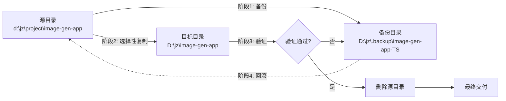
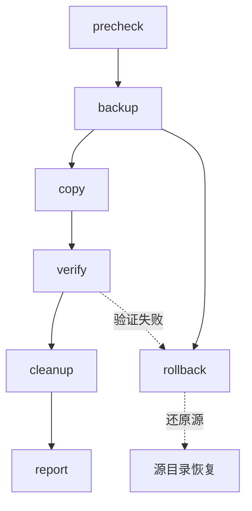
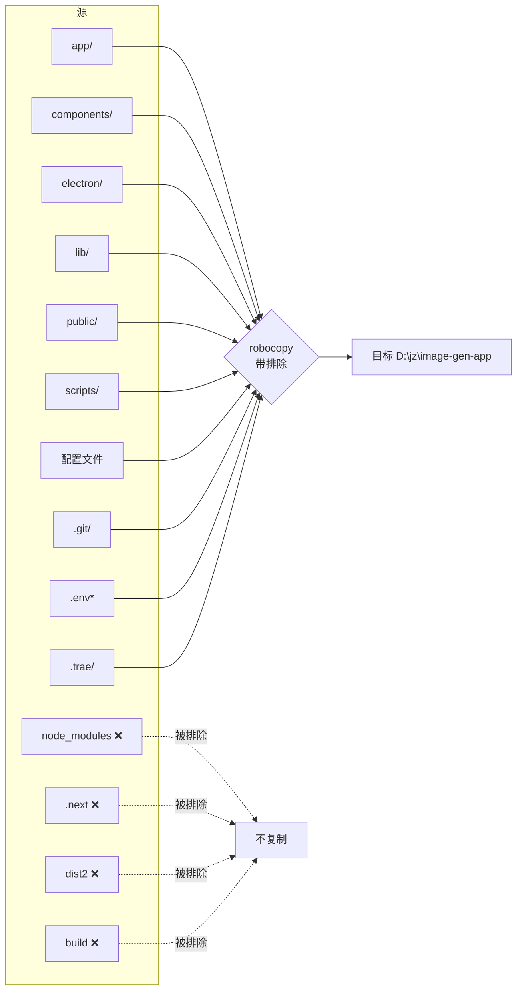

# DESIGN - 项目迁移架构设计文档

## 1. 整体架构

迁移任务采用 **备份-复制-验证-清理** 四阶段架构，每阶段独立可回滚。



## 2. 分层设计

### 2.1 阶段分层

| 阶段 | 任务 | 可逆性 | 风险等级 |
|------|------|--------|----------|
| L1 - 预检 | 验证环境 | 完全可逆 | 低 |
| L2 - 备份 | 完整镜像源目录 | 完全可逆 | 低 |
| L3 - 复制 | 选择性复制到目标 | 部分可逆（备份可还原） | 中 |
| L4 - 验证 | 多维度校验 | 完全可逆 | 低 |
| L5 - 清理 | 删除源目录 | 部分可逆（备份可还原） | 高 |
| L6 - 报告 | 输出文档 | 完全可逆 | 低 |

### 2.2 核心组件

#### 组件 1: 预检模块（precheck.ps1）
- 输入：源路径、目标路径
- 输出：预检结果（通过/失败 + 原因）
- 关键检查项：
  - 源目录存在性
  - 目标父目录可写
  - 目标子目录不存在或为空
  - 磁盘空间（需 ≥ 1GB）

#### 组件 2: 备份模块（backup.ps1）
- 输入：源路径、备份目录
- 输出：备份路径、备份大小
- 实现：使用 robocopy 完整镜像源目录
- 备份位置：`D:\jz\.backup\image-gen-app-{timestamp}`

#### 组件 3: 复制模块（copy.ps1）
- 输入：源路径、目标路径
- 输出：复制结果
- 实现：robocopy + 排除参数
- 排除项：见 CONSENSUS 4.1 / 4.2

#### 组件 4: 验证模块（verify.ps1）
- 输入：源路径（已备份前快照）、目标路径
- 输出：验证结果 + 差异报告
- 检查维度：
  - 关键文件存在性
  - 排除项正确排除
  - 关键文件 SHA256 一致性
  - Git 仓库可用性

#### 组件 5: 清理模块（cleanup.ps1）
- 输入：源路径
- 输出：删除确认
- 实现：交互式二次确认后执行
- 安全机制：仅在验证通过后调用

#### 组件 6: 报告模块（report.ps1）
- 输入：迁移过程日志
- 输出：`FINAL_migrate-project.md`

## 3. 模块依赖关系



依赖原则：
- **严格串行**：每阶段必须成功才能进入下一阶段
- **可回滚**：任何阶段失败都可回滚到 L2（备份）状态
- **可中断**：用户在每个阶段前可中止

## 4. 接口契约

### 4.1 预检接口
```powershell
# 输入参数
$SourcePath = "d:\jz\project\image-gen-app"
$TargetPath = "D:\jz\image-gen-app"

# 输出
[bool]$IsReady, [string[]]$Blockers
```

### 4.2 备份接口
```powershell
# 输入
$SourcePath, $BackupRoot = "D:\jz\.backup"

# 输出
[string]$BackupPath, [long]$BackupSize
```

### 4.3 复制接口
```powershell
# 输入
$SourcePath, $TargetPath, [string[]]$ExcludeDirs, [string[]]$ExcludeFiles

# 输出
[int]$ExitCode, [string[]]$FailedFiles
```

### 4.4 验证接口
```powershell
# 输入
$SourcePath, $TargetPath

# 输出
[bool]$IsValid, [hashtable]$Report = @{
    RequiredFiles = @{...}
    ExcludedItems = @{...}
    GitStatus    = "..."
}
```

## 5. 数据流向图



## 6. 异常处理策略

| 异常场景 | 处理策略 | 回滚方式 |
|---------|---------|---------|
| 预检失败 | 终止任务，输出阻塞项 | 无需回滚 |
| 备份失败 | 终止任务，提示排查 | 无需回滚 |
| 复制部分失败 | 记录失败文件，询问用户 | 删除目标，从备份恢复 |
| 复制完全失败 | 自动回滚 | 从备份完整恢复 |
| 验证失败 | 不删除源目录 | 备份已存在，用户决定 |
| 清理失败 | 手动提示用户 | 备份保留 |

## 7. 安全策略

1. **API 密钥保护**
   - `.env` / `.env.local` 文件包含 OpenAI 等 API 密钥
   - 复制时使用 `/SEC` 参数保留 NTFS 权限
   - 复制完成后提示用户确认密钥文件存在
   - 不在任何日志中输出 `.env` 文件内容

2. **Git 仓库保护**
   - `.git/` 完整保留
   - 不执行任何 git 命令修改历史
   - 不触发 Git 钩子

3. **删除保护**
   - 源目录删除需要二次确认
   - 备份目录永不被自动删除

4. **路径安全**
   - 使用 PowerShell 的 `-LiteralPath` 避免路径注入
   - 不使用字符串拼接构造路径
