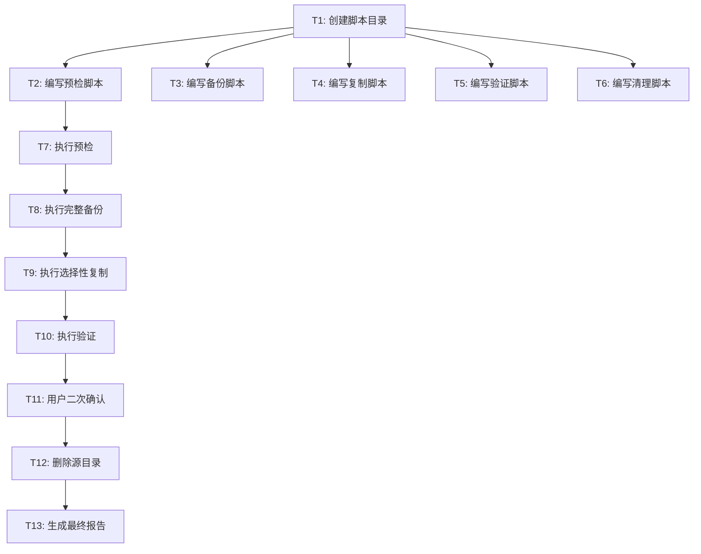

# TASK - 项目迁移原子任务清单

## 1. 任务依赖图

## 2. 原子任务清单

### T1: 创建迁移脚本目录
- **输入契约**：
  - 前置依赖：无
  - 输入数据：无
  - 环境依赖：PowerShell 5.1+
- **输出契约**：
  - 输出数据：创建 `d:\jz\project\image-gen-app\scripts\migrate\` 目录
  - 交付物：目录结构
  - 验收标准：目录存在且可写
- **实现约束**：使用 `New-Item -ItemType Directory`
- **依赖关系**：所有后续任务的前置

### T2: 编写预检脚本 precheck.ps1
- **输入契约**：
  - 前置依赖：T1
  - 输入数据：源路径、目标路径
  - 环境依赖：PowerShell
- **输出契约**：
  - 输出数据：返回 `$IsReady` 布尔值和 `$Blockers` 阻塞项数组
  - 交付物：`scripts\migrate\precheck.ps1`
  - 验收标准：
    - 源目录存在性检查
    - 目标父目录可写检查
    - 目标子目录不存在性检查
    - 磁盘空间检查（≥ 1GB）
- **实现约束**：纯函数式，不修改任何文件

### T3: 编写备份脚本 backup.ps1
- **输入契约**：
  - 前置依赖：T1
  - 输入数据：源路径、备份根路径
  - 环境依赖：robocopy
- **输出契约**：
  - 输出数据：备份目录路径、备份大小
  - 交付物：`scripts\migrate\backup.ps1`
  - 验收标准：使用 robocopy 完整镜像源目录
- **实现约束**：使用时间戳命名备份目录

### T4: 编写复制脚本 copy.ps1
- **输入契约**：
  - 前置依赖：T1
  - 输入数据：源路径、目标路径、排除项列表
  - 环境依赖：robocopy
- **输出契约**：
  - 输出数据：复制退出码、失败文件列表
  - 交付物：`scripts\migrate\copy.ps1`
  - 验收标准：
    - 排除 `node_modules`、`.next`、`dist2`、`build`
    - 排除 `tsconfig.tsbuildinfo`
    - 排除 `test-*` 和 `启动.bat`
    - 保留 `.git/`、`.env*`、`.trae/`
- **实现约束**：使用 robocopy 的 `/XD` 和 `/XF` 参数

### T5: 编写验证脚本 verify.ps1
- **输入契约**：
  - 前置依赖：T1
  - 输入数据：源路径（备份前快照）、目标路径
  - 环境依赖：PowerShell、Git
- **输出契约**：
  - 输出数据：验证结果哈希表
  - 交付物：`scripts\migrate\verify.ps1`
  - 验收标准：
    - 关键文件存在性检查
    - 排除项未迁移检查
    - 关键文件 SHA256 一致性
    - Git 仓库可用性（`git status` 正常）
- **实现约束**：使用 `Get-FileHash` 计算 SHA256

### T6: 编写清理脚本 cleanup.ps1
- **输入契约**：
  - 前置依赖：T1
  - 输入数据：源路径
  - 环境依赖：PowerShell
- **输出契约**：
  - 输出数据：删除确认
  - 交付物：`scripts\migrate\cleanup.ps1`
  - 验收标准：交互式二次确认后才执行删除
- **实现约束**：使用 `Remove-Item -Recurse -Force`

### T7: 执行预检
- **输入契约**：
  - 前置依赖：T2 完成
  - 输入数据：源路径 `d:\jz\project\image-gen-app`、目标路径 `D:\jz\image-gen-app`
- **输出契约**：
  - 输出数据：预检通过状态
  - 验收标准：所有预检项通过
- **依赖关系**：T8 的前置

### T8: 执行完整备份
- **输入契约**：
  - 前置依赖：T7 通过、T3 完成
  - 输入数据：源路径
- **输出契约**：
  - 输出数据：备份目录路径
  - 验收标准：备份目录存在且包含完整源目录内容
- **依赖关系**：T9 的前置

### T9: 执行选择性复制
- **输入契约**：
  - 前置依赖：T8 完成、T4 完成
  - 输入数据：源路径、目标路径
- **输出契约**：
  - 输出数据：复制退出码
  - 验收标准：
    - 目标目录创建成功
    - 排除项正确排除
    - robocopy 退出码 ≤ 7
- **依赖关系**：T10 的前置

### T10: 执行验证
- **输入契约**：
  - 前置依赖：T9 完成、T5 完成
  - 输入数据：源路径、目标路径
- **输出契约**：
  - 输出数据：验证结果
  - 验收标准：
    - 关键文件存在
    - 排除项未迁移
    - Git 可用
    - SHA256 一致
- **依赖关系**：T11 的前置

### T11: 用户二次确认（删除前）
- **输入契约**：
  - 前置依赖：T10 通过
  - 输入数据：迁移结果摘要
- **输出契约**：
  - 输出数据：用户确认 Y/N
  - 验收标准：用户输入 Y
- **依赖关系**：T12 的前置

### T12: 删除源目录
- **输入契约**：
  - 前置依赖：T11 用户确认、T6 完成
  - 输入数据：源路径
- **输出契约**：
  - 输出数据：删除成功状态
  - 验收标准：源目录不再存在
- **依赖关系**：T13 的前置

### T13: 生成最终报告
- **输入契约**：
  - 前置依赖：T12 完成
  - 输入数据：迁移过程日志
- **输出契约**：
  - 输出数据：报告文件
  - 交付物：`d:\jz\image-gen-app\docs\migrate-project\FINAL_migrate-project.md`
  - 验收标准：报告内容完整

## 3. 任务复杂度评估

| 任务 | 复杂度 | 风险 | 估时（参考） |
|------|--------|------|--------------|
| T1 | 极低 | 无 | 1 分钟 |
| T2 | 低 | 低 | 5 分钟 |
| T3 | 低 | 低 | 3 分钟 |
| T4 | 中 | 中 | 5 分钟 |
| T5 | 中 | 低 | 5 分钟 |
| T6 | 低 | 低 | 3 分钟 |
| T7-T10 | 低 | 低 | 各 1-2 分钟 |
| T11 | 无 | 无 | 等待用户 |
| T12 | 低 | 中 | 1 分钟 |
| T13 | 低 | 无 | 2 分钟 |

> 说明：复杂度评估的目的是风险提示，不是时间承诺。

## 4. 风险与回滚点

| 任务 | 失败影响 | 回滚方式 |
|------|---------|---------|
| T1-T7 | 无 | 重做 |
| T8（备份） | 不可回滚 | 必须重做 |
| T9（复制） | 目标目录残留 | 删除目标 + 备份恢复 |
| T10（验证） | 不可回滚 | 重新验证 |
| T11（确认） | 不删除 | 用户拒绝则保留源 |
| T12（删除） | 数据丢失 | 备份恢复 |
| T13（报告） | 无 | 重做 |
